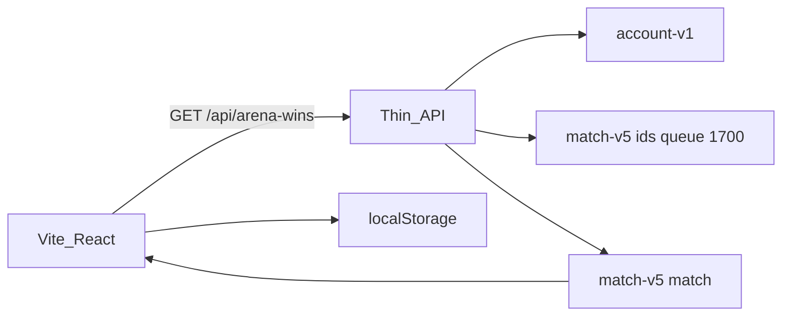

# Arena Wins Checklist + Riot Sync

Rebuild arena-checklist.lol as a Vite + React app with local champion tracking, plus a thin API proxy that syncs real Arena 1st-place wins from Riot Match-v5 by Riot ID — no user accounts.

## Can Vite/React call Riot directly?

**No — not safely.** Riot requires a secret API key. Putting it in a Vite client exposes it to anyone. Pattern: React UI + tiny backend proxy that holds `RIOT_API_KEY` and returns only the data we need (won champion IDs).

No accounts, no login, no DB for users. Progress stays in `localStorage`. Sync is: enter `GameName#TAG` → backend returns champions with Arena 1sts → UI marks them complete.



## Product (parity with arena-checklist.lol + sync)

- Champion grid with DDRAGON splash/icons, click to toggle win
- Not completed / Completed sections with counts
- Search + filter (all / missing / done)
- Dark mode + mobile-first layout
- Persist progress in `localStorage`; export/import JSON backup
- **Sync panel:** Riot ID + region → fetch wins → merge into local checklist (never wipe manual marks unless user opts in)
- Links out to Arena builds (e.g. u.gg / op.gg arena) optional, low priority

## Stack

| Layer     | Choice                                                                             |
| --------- | ---------------------------------------------------------------------------------- |
| Frontend  | Vite + React + TypeScript                                                          |
| Styling   | CSS variables, dark mode default, expressive fonts (not Inter)                     |
| Champions | [DDRAGON](https://ddragon.leagueoflegends.com) champion list + images (no API key) |
| Backend   | Small Hono (or Express) server in-repo, same monorepo                              |
| Deploy    | Frontend static + API on Railway (or similar); API key via env                     |

## Riot sync logic (backend)

1. `GET /riot/account/v1/accounts/by-riot-id/{gameName}/{tagLine}` → `puuid`
2. Paginate `GET /lol/match/v5/matches/by-puuid/{puuid}/ids?queue=1700&count=100` (also run for `1710` if needed)
3. For each match ID: `GET /lol/match/v5/matches/{matchId}`; find participant by `puuid`; if `placement === 1` (or `win === true`), record `championName` / `championId`
4. Return `{ champions: string[], scanned: number, challengeValue?: number }`
5. Optionally call challenges-v1 (`602002`) for the official unique-win **count** as a sanity check — it does **not** list which champs

**Rate limits:** Personal key ≈ 100 req / 2 min. Deep backfill must be sequential with backoff, progress streaming or multi-step (“scan next 100”) so the UI doesn’t hang. Cache match JSON briefly server-side to avoid re-fetching the same IDs.

**Policy:** Champion win checklist only — do not expose augment/item win rates.

## Repo layout

```
league-arena/
  package.json          # workspaces or single package with scripts
  apps/web/             # Vite React UI
  apps/api/             # Hono proxy + Riot client
  .env.example          # RIOT_API_KEY, CORS origin
```

## Frontend data model

```ts
// localStorage key e.g. arena-checklist-v1
{
  completed: Record<string, true>, // champion id → won
  theme: "dark" | "light",
  lastSync?: { riotId: string, at: string, scanned: number }
}
```

Champion catalog loaded once from DDRAGON `champion.json`. New champs appear automatically when DDRAGON updates.

## API surface (no auth)

- `GET /api/health`
- `GET /api/arena-wins?gameName=&tagLine=&region=&start=0&count=100`
  - Resolves account, scans a page of Arena matches, returns newly found 1st-place champs + pagination cursor
  - Frontend loops until done or user stops, merging results each page

Region maps platform → routing value (`na1` → `americas`, `euw1` → `europe`, etc.).

## Out of scope for v1

- User accounts / RSO login
- Database of player progress
- Live LCU / champ-select overlay
- Augment or item analytics

## What you need to provide

- A Riot [developer](https://developer.riotgames.com) API key in `.env` (`RIOT_API_KEY`)
- Personal key works for private use; for a public site later, apply for a production key (still no RSO required for Riot-ID lookup of public match history)
